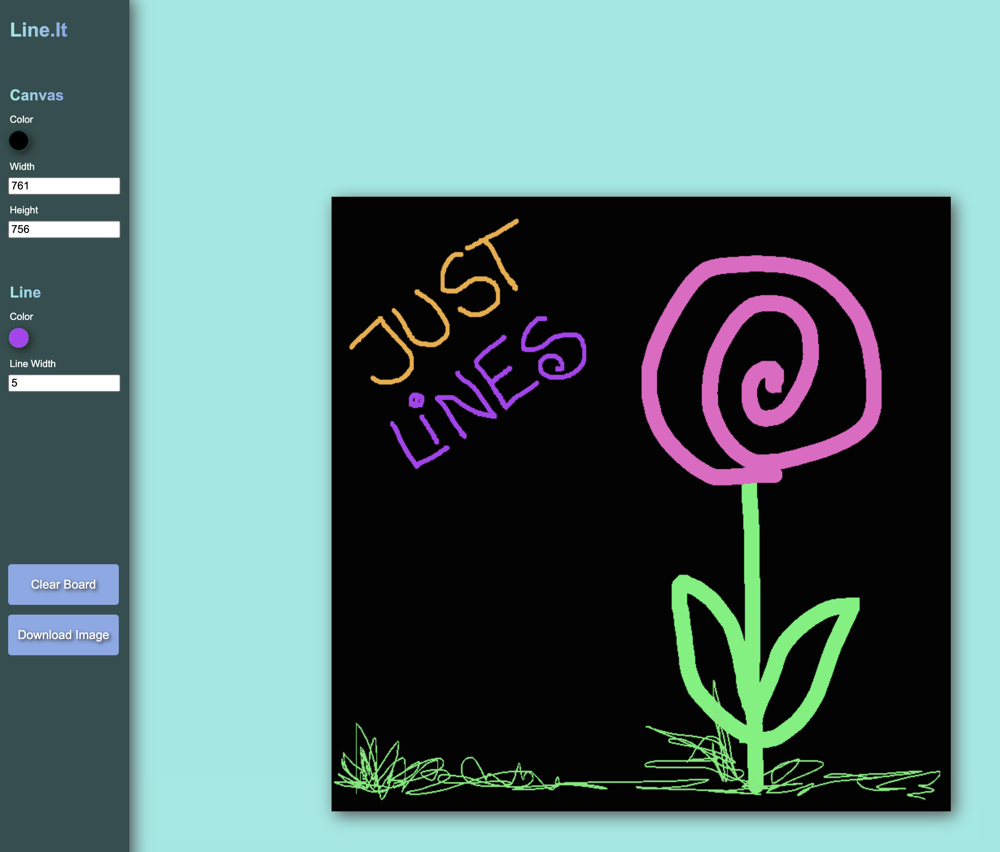

# $${\color{lightblue}Line.It}$$ 
$${\color{lightblue}Canvas-Line-Drawer}$$
****
### A little fun project inbetween to draw on canvas.

* Change width and height of background
* Change stroke-width
* Change stroke-color

If you don't like your result, clear the board.\
But if you **DO** like it, you can download it as *.png

You can see it live and play with it here:

https://line-it.netlify.app/
